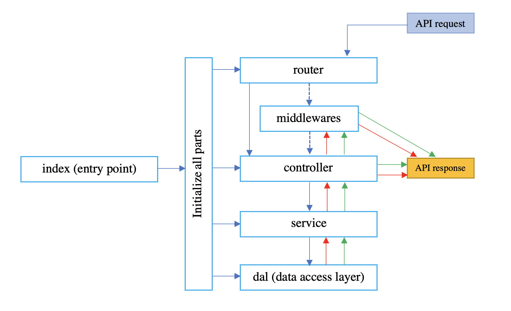

# Node.js server template

## Table of contents
* [General info](#general-info)
* [Technologies](#technologies)
* [Setup](#setup)
* [Style guide](#style-guide)
* [Architecture guide](#architecture-guide)

### General info
12.03.21 Updates. Great news ! :fire: :heart: \
In this template every time we manually create 7 files for one CRUD logic. Now you can create your CRUD new files at once just using `rest-resource-file-generator` npm module made by me :tophat: \
Here is the link of instructions in npm [rest-resource-file-generator](https://www.npmjs.com/package/rest-resource-file-generator) \
This is a simple Node.js server application boilerplate with CRUD operations simple logic. It provides REST APIs. 
Before using it, please ensure that you've already installed the following programs\
[Git](https://git-scm.com/book/en/v2/Getting-Started-Installing-Git) as version control,\
[Node.js](https://nodejs.org/en/) as server program,\
[Yarn](https://yarnpkg.com/lang/en/docs/install/#mac-stable) as Node.js package manager,\
[MongoDb](https://docs.mongodb.com/manual/installation/) as database program.\
If you haven't, these are their links for installing.

### Technologies
Program/lib | version | command for checking\
Git | 2.30.1 | `git --version`\
Node.js | v16.6.1 | `node -v` \
Express | ^4.17.1 | see in app package.json\
MongoDB | v4.4.5 | `mongo --version`\
Mongoose | ^6.0.11 | see in this app package.json\
Mocha | 9.1.3 | see in this app package.json\
Eslint | 8.0.1 | see in this app package.json\
Yarn | 1.22.10 | `yarn -v`

### Setup
1. Clone this repository\
`git clone https://github.com/Vladinho10/node-server-template.git` 
2. Fill in your git credentials (if required)
3. Enter the downloaded directory.\
`cd node-server-template`
4. Create your .env files like `.env` file in envs directory. 

for npm
* install packages\
   `npm i` 
* run server\
   `npm run start`
   or \
   `npm start`
* if you want your server stay always running\
`npm run nodemon`

for yarn
* install packages\
 `yarn`
* run server\
 `yarn run start`
 or\
  `yarn start`
* if you want your server stay always running\
`yarn run nodemon`
or\
 `yarn nodemon` 

## Style guide 
We suggest our ESLint configs which are inspired by AirBnB configs. We are open to any suggestions from contributors if they are inline with our philosophy. \
These ESLint configs are written and tuned for modern JavaScript development. So we don’t support old, outdated JavaScript methods, e.g. 
obj = new Object() this construct because we can just use const obj = {};\
[more](https://github.com/Vladinho10/node-server-template/blob/master/guides/style-guide.md)

## Architecture guide

The software architecture (SA) is one of the most important parts of the software development. It helps developers to easily integrate into the existing codebase.
The architecture describes a set of aspects and decisions of the software. \
[more](https://github.com/Vladinho10/node-server-template/blob/master/guides/architecture-guide.md)
  
